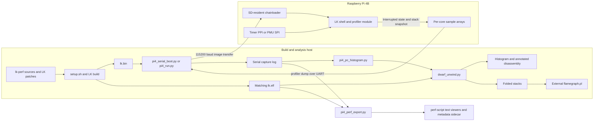
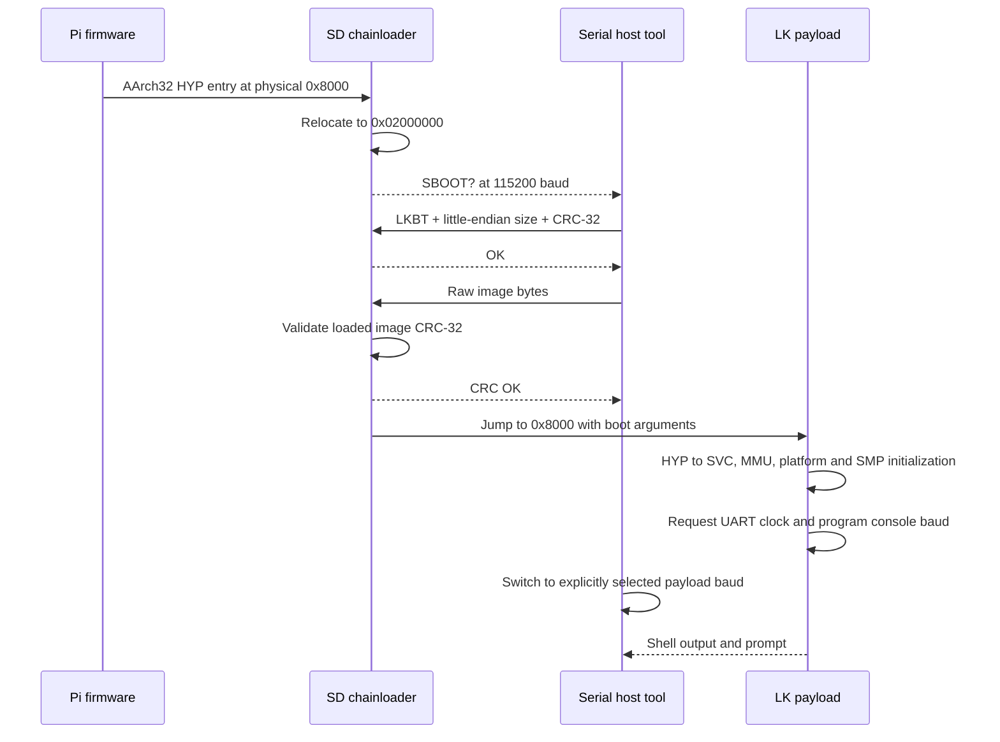
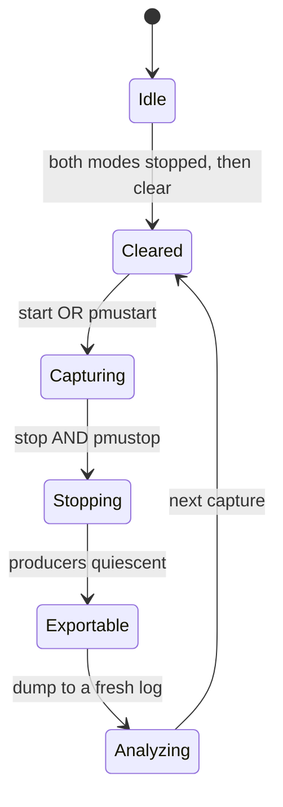

# lk-perf architecture and design

**Implementation baseline:** lk-perf commit `5919f4006057cd8f20f5696d95ab749f171f3aa6`, inspected on 2026-10-05. This document describes the code at that revision; it does not claim a new hardware-validation run. Historical hardware observations are attributed to [RPI4_BRINGUP.md](RPI4_BRINGUP.md).

**Exporter addition (2026-10-05):** the host-side timestamped perf-script
exporter described below was added after this capture baseline. Its real
Perfetto importer verification and current usage are documented in
[EXPORT.md](EXPORT.md) and [the verification record](results/PERF_EXPORT_VERIFICATION.md).
The target capture implementation is unchanged.

lk-perf is a statistical sampling profiler for Little Kernel (LK) workloads executing in AArch32 on multiple cores. The target captures interrupted execution state and a bounded stack snapshot; Python tools recover call chains from the matching debug ELF and produce function histograms, disassembly annotations, and FlameGraph input. It is a standalone performance tool. It has no dependency on BOLT and does not validate BOLT transformations.

This is the current implementation reference. [DESIGN.md](DESIGN.md) retains the original staged design and QEMU development history. [RPI4_BRINGUP.md](RPI4_BRINGUP.md) retains hardware evidence, decisions, and the work backlog. Its dated entries sometimes describe intermediate implementations; the actual source and later corrections govern the behavior described here. This document is not a second TODO queue.

## Contents

1. [Purpose, scope, and platform contract](#1-purpose-scope-and-platform-contract)
2. [System architecture and component boundaries](#2-system-architecture-and-component-boundaries)
3. [Build, boot, and platform integration](#3-build-boot-and-platform-integration)
4. [Sampling and interrupted-context capture](#4-sampling-and-interrupted-context-capture)
5. [Buffer layout, ownership, and lifecycle](#5-buffer-layout-ownership-and-lifecycle)
6. [PMU control and counting](#6-pmu-control-and-counting)
7. [Transport and dump-format contract](#7-transport-and-dump-format-contract)
8. [Offline unwinding and symbolization](#8-offline-unwinding-and-symbolization)
9. [Reports and measurement semantics](#9-reports-and-measurement-semantics)
10. [Operational workflow](#10-operational-workflow)
11. [Correctness boundaries and failure behavior](#11-correctness-boundaries-and-failure-behavior)
12. [Validation evidence and extension design](#12-validation-evidence-and-extension-design)
13. [Source map](#13-source-map)

## 1. Purpose, scope, and platform contract

### 1.1 Questions the tool answers

- Which functions account for the largest share of accepted samples?
- Which calling contexts lead to those functions, when the captured context and CFI allow recovery?
- Which instruction addresses inside a hot function receive samples?
- Are samples spread across cores and thread pointers, or concentrated in a subset?
- Where does execution land when a selected PMU event counter overflows?

It does not provide a complete instruction trace, an exact accounting of every cycle, or exact event-causing instruction attribution. The timer mode approximates execution occupancy; PMU mode samples overflow contexts. The quality of either interpretation depends on sampling bias, capture completeness, and matching build artifacts.

### 1.2 Platform assumptions

| Property | Current validation platform | Intended deployment contract |
|---|---|---|
| CPU and board | Raspberry Pi 4B, BCM2711, four Cortex-A72 cores | Multi-core Cortex-A55 system; port still requires target validation |
| Execution | AArch32, ARM/Thumb interworking | AArch32, ARM/Thumb interworking |
| Kernel mode and security | Non-secure SVC after the HYP entry transition | Non-secure SVC, as corrected in the 2026-10-05 hardware notes |
| Thread stacks | LK threads remain in SVC mode | The same assumption must hold for the interrupted-SP derivation |
| Floating point and SIMD | VFP/NEON disabled in the LK configuration | Target workload has no FPU/NEON dependency |
| Interrupt controller | GIC-400, GICv2 path | Routing and interrupt identifiers must be supplied by the target port |
| Unwind metadata | Host-side `.debug_frame` in an unstripped matching ELF | Firmware debug-symbol ELF carries DWARF CFI; EXIDX is not the selected interface |
| Capture export | PL011 console over USB serial | Trace32/JTAG memory extraction is a possible future path, not implemented |

The Pi verifies the mechanism on real silicon. It cannot establish Cortex-A55 timing, cache behavior, event availability, or final RAM cost. No ETM, SPE, or BRBE interface is implemented or assumed by this tool. QEMU belongs to its early development history; current hardware claims come from the Pi track.

### 1.3 Design choices

1. Capture a small amount of state in interrupt context; perform expensive unwind and reporting work on the host.
2. Copy stack bytes at sample time, because a live thread can return and reuse its stack before the host retrieves it.
3. Use independent per-core storage so concurrent interrupt handlers do not contend on a shared sample-buffer lock.
4. Reuse the scheduler timer for timer sampling, avoiding a second owner of timer hardware.
5. Use a shared time base for timestamps, rather than each core's PMU cycle counter.
6. Keep LK integration as ordered patches and copied modules, rather than a maintained LK fork.
7. Preserve usable leaf samples when a particular call-chain unwind fails.

## 2. System architecture and component boundaries



| Layer | Responsibility | Boundary |
|---|---|---|
| LK exception-entry overlay | Preserve interrupted r7/r11 before C code changes them | Depends on LK's AArch32 exception ABI and CPU-index formula |
| GIC dispatch overlay | Call `profiler_on_tick(frame, vector)` while the iframe is available | Called before normal registered-vector dispatch |
| `app/profiler` | Select sampling vectors, capture state, retain samples, expose shell commands, control PMU | No DWARF interpretation or symbolization on target |
| BCM2711 platform overlay | Boot transition configuration, mappings, GIC, SMP, timer, RAM discovery, UART speed, watchdog reset | Board-specific implementation, not a generic A55 port |
| Serial host tools | Find the adapter, load a raw image, switch baud, run commands, record output | Do not automatically identify a payload's build or console baud |
| Host parser and unwinder | Validate sample checksums, reconstruct stacks, map addresses, summarize | Requires the correct ELF and supported CFI rules |
| FlameGraph renderer | Convert collapsed stack counts into SVG | Downloaded external script; not profiler runtime code |

The control plane is the LK shell plus the serial driver. The data plane is IRQ capture, per-core arrays, text dump, and offline analysis. Sampling does not depend on continuous host attachment: export occurs later, but only retained samples survive.

The standalone perf-script exporter adds a stricter host conversion path
beside the histogram tool. It reuses checksum/unwind helpers, requires one
completed dump, sorts individual samples by timestamp, and exports a separate
JSON provenance/quality sidecar. It does not modify the target data plane.

## 3. Build, boot, and platform integration

### 3.1 Overlay build model

[`setup.sh`](../setup.sh) ensures `arm-none-eabi-gcc` and pyelftools are available, then clones or updates upstream `littlekernel/lk` into `build/lk` (overridable with `LK_DIR`). LK follows the upstream default-branch tip; it is **not pinned**. The script prints the resolved LK revision, copies profiler/project/target modules, applies `overlay/lk/*.patch` in filename order, and fetches `scripts/flamegraph.pl` if absent.

The build entry point is `make rpi4-test` inside the generated LK tree. [`project/rpi4-test.mk`](../project/rpi4-test.mk) selects `TARGET := rpi4` and includes the shell, profiler, and supporting modules. [`target/rpi4/rules.mk`](../target/rpi4/rules.mk) selects platform `bcm28xx`. The platform patch sets `ARCH := arm`, `ARM_CPU := cortex-a15`, `WITH_SMP := 1`, `BCM2711=1`, and `ARM_WITH_HYP=1`. The `cortex-a15` build setting is an LK configuration choice; it does not change the board's actual A72 CPU identity.

Patch 0007 sets `ARM_WITHOUT_VFP_NEON := true`. The project omits `app/tests`, whose math dependency could introduce VFP instructions independently of the kernel setting. Historical linked-image disassembly found no VFP/NEON instructions; a fresh build needs its own scan before making that claim again.

`setup.sh` resets tracked changes in the generated LK tree before updating it. It should not be used to refresh an active development tree containing unexported LK changes. Reverse-apply checks avoid reapplying an already present patch, but the patch-created untracked `gic.h` makes a second setup run a known idempotence problem. Neither the moving upstream revision nor the downloaded FlameGraph script is automatically locked by version or hash.

### 3.2 Boot chain



[`experiments/pi4-serialboot`](../experiments/pi4-serialboot/README.md) is resident on the SD card. It relocates away from the payload area, preserves the firmware's boot arguments, and relocates the DTB to `0x02100000` if the payload would overwrite it. Normal iterations replace the RAM payload over serial; they do not rewrite the SD card.

The payload is loaded at physical `0x00008000`; LK uses `KERNEL_BASE = 0x80000000` with a corresponding load offset. `ARM_WITH_HYP=1` enables the startup transition needed before the ordinary SVC MMU setup. The early RAM mapping covers the first 1 GiB so the firmware-provided DTB is reachable. That mapping is scaffolding, not a declaration that every mapped byte is allocatable RAM.

### 3.3 Board resources

| Resource | Pi configuration in the overlay | Purpose |
|---|---|---|
| Device window | Physical `0xFC000000` mapped to virtual `0xE0000000`, 64 MiB | Main peripherals, ARM-local block, and GIC |
| PL011 UART0 | Physical `0xFE201000` | Console and sample export |
| GIC distributor | Physical `0xFF841000` | Interrupt configuration/routing |
| GIC CPU interface | Physical `0xFF842000` | Per-core interrupt delivery |
| Generic timer | GIC interrupt ID 30, PPI | Scheduler timer and timer-mode sample trigger |
| PMU overflow | GIC IDs 48–51, four SPIs | One routed overflow interrupt per core |
| UART interrupt | GIC ID 153 | Console input |
| Watchdog/PM block | BCM28xx platform reset implementation | Software return to the SD chainloader |

RAM discovery reads the DTB's memory-node `reg` entry using its address/size cell widths, accepts the first low region starting at address zero, and caps it at 1 GiB. It does not combine non-contiguous banks or expose above-4-GiB RAM. Invalid DTB input leaves the 256-MiB `MEMSIZE` fallback. SMP startup uses the existing BCM28xx secondary-release mechanism; real hardware bring-up confirmed all four cores scheduling.

### 3.4 UART speed contract

The chainloader always uses **115200 baud** for both handshake and image upload. Patch 0011 makes LK request a **96-MHz UART clock** from VideoCore and target **6,000,000 baud**. It computes divisors from the returned clock; if insufficient, it requests the older 48-MHz configuration and uses the 3,000,000-baud fallback. Mailbox access includes cache maintenance and conversion of the request address to a VideoCore bus address.

Both serial Python entry points still default `--post-jump-baud` to **3000000** at the baseline. For the current payload, explicitly pass `--post-jump-baud 6000000`. Baud is not negotiated after the jump; a fallback payload may require a matching explicit host setting. The host waits 0.15 seconds after changing baud and then discards buffered input, which can intentionally discard some early boot text. That settling step does not repair corruption during a sustained dump.

## 4. Sampling and interrupted-context capture

### 4.1 Exception-to-sample path

1. A timer or PMU interrupt enters LK's AArch32 IRQ entry.
2. LK constructs `struct arm_iframe` on the SVC stack. Its saved PC is corrected by the IRQ entry path; the profiler copies `frame->pc` without its own additional adjustment.
3. Overlay patches save the interrupted r7 and r11 in core-local arrays before calling C. Patch 0010 derives the index from the same `SMP_CPU_ID_BITS` and `SMP_CPU_CLUSTER_SHIFT` macros used by `arch_curr_cpu_num()`.
4. GICv2 dispatch reads the vector and invokes the profiler hook while the iframe pointer remains available.
5. The hook rejects unrelated vectors, or captures one sample into this core's current slot.
6. A PMU sample additionally clears counter-0 overflow and reloads counter 0; normal GIC dispatch then continues.

The hook runs for every dispatched valid interrupt, even when no sampling mode is active. It performs vector/enable checks before copying stack data. The target capture path allocates no memory, performs no symbol lookup, and prints nothing. It nevertheless has nonzero overhead: register stores, a 128-byte copy, timestamp retrieval, and PMU register operations when applicable.

### 4.2 Timer mode

`profiler start` sets a shared timer-enable flag; `profiler stop` clears it. The profiler does not create or reprogram a timer. It captures scheduler timer interrupts on each core: ID 30 on BCM2711, with the retained non-BCM2711 branch using ID 27. Sampling cadence therefore follows LK's actual timer configuration and scheduling behavior. Historical notes mention 100 Hz; that value is not an independent profiler rate guarantee or a configurable CLI setting.

### 4.3 PMU mode

`profiler pmustart <event> <count>` programs event counter 0 on all cores, with reload `2^32 - count`. Each overflow invokes the capture hook, which clears its overflow flag and reinstalls the reload. `profiler pmustop` disarms all cores. These commands are compiled as hardware operations only for `BCM2711`.

Timer and PMU enables are independent. Both modes write into the same arrays. The record has no mode/event field, so enabling both produces a mixture that the host cannot separate. A meaningful current capture should use one mode and a fresh buffer/log.

### 4.4 Captured context

| Field | Source | Interpretation |
|---|---|---|
| `pc` | `frame->pc` | Interrupted instruction address |
| `lr` | `frame->lr` | Interrupted SVC LR; may be a scratch value unless CFI recovers a saved return address |
| `fp` | Saved r7 when SPSR.T is set, otherwise saved r11 | One register candidate, not proof that a frame-pointer chain exists |
| `sp` | `(uint32_t)(frame + 1)` | Pre-IRQ SVC SP under the current exception ABI |
| `spsr` | `frame->spsr` | Interrupted CPSR, including mode and ARM/Thumb state |
| `tid` | `get_current_thread()` cast to a 32-bit pointer value | Thread-object identity at capture, not a durable numeric TID |
| `ts` | `current_time_hires()` | 64-bit microsecond timestamp derived from the generic timer time base |
| `stack` | 128 bytes copied from the interrupted SP | Captured memory window used for offline unwind reads |

The generic iframe saves r0–r3 and r12 as well, but the profiler does not retain those registers in samples. It also does not retain all r4–r11 or both FP candidates. The host starts unwinding with just SP, LR, and the chosen r7/r11. Supporting CFI rules for arbitrary general-purpose registers does not mean those registers were captured.

### 4.5 Why `frame + 1` is the interrupted SP

With VFP disabled, the current iframe contains ten 32-bit words: USR SP/LR, r0–r3, r12, SVC LR, interrupted PC, and SPSR. IRQ entry saves the exception return state on the SVC stack, switches to SVC, saves the register words, and then adds alignment bookkeeping below that frame. Its argument pointer refers to the frame before alignment padding. Advancing by `sizeof(struct arm_iframe)` therefore reaches the SVC SP before those pushes.

`frame->usp` and `frame->ulr` are the **USR bank**, saved using the banked-register form of `stmia`; they are not the interrupted SVC thread's SP/LR. This distinction is essential to the design. The calculation must be rechecked if threads can run in USR/SYS or another mode, the exception frame changes, or target entry code differs. The profiler records SPSR but does not currently reject samples outside the assumed mode.

## 5. Buffer layout, ownership, and lifecycle

### 5.1 Structure of arrays

Samples use separate named global arrays rather than a C struct array. This makes every column independently discoverable in an ELF symbol table for a future memory-dump extractor; that extractor is not implemented today.

| Global | Dimensions | Bytes per slot |
|---|---|---:|
| `profiler_pc_buf`, `profiler_lr_buf`, `profiler_fp_buf` | `[SMP_MAX_CPUS][4096]` each | 12 combined |
| `profiler_sp_buf`, `profiler_spsr_buf`, `profiler_tid_buf` | `[SMP_MAX_CPUS][4096]` each | 12 combined |
| `profiler_ts_buf` | `[SMP_MAX_CPUS][4096]` | 8 |
| `profiler_stack_buf` | `[SMP_MAX_CPUS][4096][128]` | 128 |
| `profiler_head`, `profiler_total` | `[SMP_MAX_CPUS]` each | Per-core metadata |

The sample payload is **160 bytes per slot**: `6 × 4 + 8 + 128`. With four configured cores and 4096 slots each, the sample arrays occupy **2,621,440 bytes (2.5 MiB)**, excluding counters, FP capture globals, and other profiler state. Stack storage alone is 2 MiB. This is a static BSS cost regardless of whether profiling is enabled.

### 5.2 Producer and retention semantics

Only a core's own IRQ capture path writes its sample arrays during ordinary sampling. It writes fields, advances `head` modulo 4096, and increments `total`. Once full, the ring keeps the newest 4096 samples on that core and overwrites older samples. There is no producer drop counter or streaming consumer. A short hot interval and a long capture are retained differently because storage is a rolling tail, not a whole-session archive.

At a sustained per-core sample rate `R`, retained history is approximately `4096 / R` seconds. This is a sizing equation, not a measured sampling rate. `total` and `head` are 32-bit values; `total` wrap is not handled. The per-core arrays remove cross-core sample-slot contention, but no explicit cache-line padding is declared for the adjacent head/total/enabled metadata.

### 5.3 Export ordering

`dump` visits CPUs in ascending index. For each CPU, it exports `min(total, 4096)` slots, starting at zero before wrap or at `head` after wrap. Slots are oldest-to-newest **within that CPU**. The concatenated dump is not a cross-core timestamp merge. The host retains `ts` but its current report does not sort by it or construct a timeline.

### 5.4 Lifecycle and synchronization limits



This diagram describes the intended operational sequence, **not an enforced target state machine**. The CLI accepts `clear` and `dump` while sampling is active. `clear` zeroes counters and arrays without stopping other cores. `dump` reads arrays without a snapshot lock or generation validation. A checksum of a racing record can be valid even though its fields came from different sample generations.

PMU stop uses synchronous cross-core callbacks. Timer stop merely changes a shared `volatile` flag and does not explicitly wait for already executing handlers on other cores. `volatile` is not a complete publication/quiescence protocol. Stopping both modes before clear/export is the required operational discipline, but a future synchronized freeze operation is needed for a formal snapshot guarantee.

## 6. PMU control and counting

### 6.1 Per-core overflow sampling control

The PMU's selector and counters are banked per CPU. `mp_sync_exec(MP_IPI_TARGET_ALL, ...)` runs arm/disarm callbacks on all participating cores instead of programming just the core currently running the shell thread.

| Operation | Current behavior |
|---|---|
| Routing | Write GIC target bytes `01,02,04,08` for IDs 48–51 (`0x08040201`) |
| Trigger configuration | Set each overflow SPI to level, active high, then unmask |
| Arm callback | Save PMSELR, select counter 0, set event and reload, restore selector, enable counter 0, publish per-core enable, enable overflow interrupt, set PMCR.E |
| Enabled overflow | Capture sample, clear PMOVSR bit 0, reload counter 0 while saving/restoring PMSELR |
| Disabled overflow | Still clear PMOVSR bit 0 and reload counter 0 so a pending level interrupt cannot remain permanently asserted |
| Disarm callback | Disable counter-0 overflow interrupt, clear PMCR.E, clear per-core enable, clear pending overflow |

The unconditional disabled-vector acknowledgment addresses a real historical hang: stopping on another core once disabled a shared software flag while leaving an armed core's level interrupt unacknowledged. The current per-core flags and all-core callbacks address that failure mode.

The count floor is `PROFILER_PMU_MIN_COUNT = 10000`. It is a conservative guard against spending all execution time servicing overflows, not a calibrated maximum sample rate. Event/count parsing uses `strtoul(..., 0)`, so a `0x` prefix means hexadecimal; plain `11` means decimal 11, while `0x11` means event 17. Full end-pointer/range validation is not implemented. Events below 32 get a PMCEID0 warning when unsupported, but the command still tries them; it does not comprehensively validate extended events.

The routing code assumes this four-core board, and the handler recognizes any vector in 48–51 rather than proving that the vector belongs to the current CPU. Correct routing is part of the board contract. Repeated reconfiguration, pending-overflow cleanup before arming, and generic topology changes are not governed by a complete PMU resource manager.

### 6.2 Counter ownership and PMSELR

Counter 0 belongs to overflow sampling. The current `stat` command uses **event counter 1**, which fixes the earlier implementation that overwrote the sampling event in counter 0. IRQ reload and cross-core arm callbacks preserve PMSELR so they do not redirect a preempted selected-counter access.

This is partial sharing discipline, not general PMU virtualization. `stat` resets the cycle counter and does not restore every selector/enable/event-counter setting. `pmustop` clears global PMCR.E on each CPU, affecting other PMU users. Hardware state would need stronger ownership/restoration rules before arbitrary subsystems can safely share it.

### 6.3 `profiler stat`

`stat [iters]` runs the built-in `profiler_workload_a` on the shell's current core. It reads PMCEID0/1 and PMCR, programs counter 1 for event `0x03` (L1D_CACHE_REFILL), enables the cycle counter and counter 1, resets the cycle counter, runs the workload, reads both results, disables counter 1, and restores the previous PMCR value. It reports raw cycles/refills and integer-derived iterations per cycle/refills per iteration.

It is not an arbitrary-command or all-core `perf stat` equivalent. The counting window still includes setup/readout `printf` calls and possible interrupts/scheduling; the two counters are not sampled simultaneously. Counter accesses are per-core, while the command does not explicitly pin the shell thread for the full transaction. Correct continuity therefore also depends on scheduler behavior. Counts are 32-bit with no wrap extension; cycle-divider/filter state is not fully normalized. Unsupported refill events are warned about but still programmed. These results should be interpreted as diagnostic PoC counts, not precise isolated workload metrics.

## 7. Transport and dump-format contract

### 7.1 Host tools

- [`pi4_serial_boot.py`](../scripts/pi4_serial_boot.py) implements image upload and an interactive terminal. Automatic port selection recognizes common USB-serial vendor IDs and requires exactly one matching adapter unless `--port` is explicit.
- [`pi4_run.py`](../scripts/pi4_run.py) reuses upload/baud handling and executes an ordered list of LK commands. It appends CR to each command and waits for the actual `] ` shell prompt; the default hard timeout is 90 seconds per command.
- [`pi4_doctor.py`](../scripts/pi4_doctor.py) diagnoses host prerequisites and, in boot-test mode, the physical boot/serial path.
- [`pi4_baud_calibrate.py`](../scripts/pi4_baud_calibrate.py) and the calibration image support link characterization; they are not part of ordinary sampling.

Only one process may hold a serial port. `--reboot` first probes for `SBOOT?`; if absent, it switches to the configured LK baud and sends `reboot`. It then returns to loader baud and upload waits for loader confirmation. A hung or incompatible payload may still need a physical power cycle. A reboot request alone is not evidence that reset succeeded.

The command runner recognizes the prompt by its received suffix. It is not a framed RPC protocol and does not parse LK command return values. Program output resembling the prompt could mislead it. A timeout stops the remaining commands and returns failure instead of continuing into a busy shell.

### 7.2 Image-upload protocol

| Stage | Encoding/check |
|---|---|
| Loader ready | Text `SBOOT?` |
| Header | ASCII `LKBT`, unsigned 32-bit size LE, unsigned 32-bit CRC-32 LE |
| Accept/refuse | Text `OK` or `ER ...` |
| Payload | Raw binary bytes; host writes chunks of 1024 bytes |
| Integrity result | Text `CRC OK` or `ER ...`; host waits up to 60 seconds for this stage |

This **CRC-32** checks the image transfer. It is a different algorithm from the sample field named `crc`.

### 7.3 Sample text format

The current target emits one line per retained sample:

```text
SAMPLE seq=<hex> cpu=<decimal> pc=<hex> lr=<hex> fp=<hex> sp=<hex> spsr=<hex> tid=<hex> ts=<hex> stack=<hex bytes> crc=<hex>
```

| Field | Target text width | Contract |
|---|---:|---|
| `seq` | 8 hex digits | Starts at zero for every dump and advances across CPUs |
| `cpu` | Decimal | Core index used by the arrays |
| `pc`, `lr`, `fp`, `sp`, `spsr`, `tid` | 8 hex digits each | Unsigned 32-bit raw values |
| `ts` | 16 hex digits | Unsigned 64-bit timestamp |
| `stack` | 256 hex digits | Exactly 128 bytes on the current target, in memory order |
| `crc` | 8 hex digits | FNV-1a-style 32-bit field checksum |

The final target marker is `SAMPLE done`. There is no build ID, format version, run ID, mode/event ID, declared expected sample count, or structured footer. The parser accepts the field order above but its regex accepts variable hex widths and it does not explicitly require the target's stack length. Older samples without `seq`/`crc` do not match this parser. Console echoes and unrelated text are ignored.

### 7.4 Sample checksum

`profiler_sample_checksum()` and Python `_sample_checksum()` use the same algorithm:

```text
c = 0x811c9dc5
for v in [cpu, seq, pc, lr, fp, sp, spsr, tid, ts_low32, ts_high32]:
    c = ((c XOR v) * 16777619) modulo 2^32
for byte in stack[0:128]:
    c = ((c XOR byte) * 16777619) modulo 2^32
```

The metadata loop folds whole 32-bit values, not their individual bytes; only the stack is folded byte by byte. Consequently the implementation is FNV-1a-style, not a conventional CRC or standard byte-stream FNV serialization. It detects accidental text corruption after parsing but cannot prove sample provenance, recover damaged bytes, or certify a coherent target snapshot.

The parser tracks the next sequence number and warns about gaps; checksum failures are discarded individually. Gap counts are a heuristic when sequences reset, duplicate, or are corrupted. Missing trailing lines cannot be counted without a subsequent sequence/expected total. `SAMPLE done` is not enforced, so a truncated log can still produce a report. Sequence is export order, not original capture order, and does not measure ring overwrite loss.

### 7.5 Transfer cost and run isolation

Hex encoding doubles the stack payload, and text metadata adds more bytes. With one-digit CPU IDs, current fields occupy 397 bytes per line including LF; a full four-core dump is roughly 6.20 MiB before console/log additions and possible CRLF expansion. At ideal 8N1 6-Mbaud throughput (600,000 bytes/s), that alone takes about 10.8 seconds. Actual throughput depends on formatted-print cost, USB/driver behavior, and host logging; this is a theoretical lower bound, not a measured promise.

Logs open in append mode. The host parser scans **every matching line** in the file, including earlier boots and repeated dumps. Use a new log path per capture and do not report the same ring repeatedly into it. A future run-aware header/footer is needed to make isolation and completeness automatic.

## 8. Offline unwinding and symbolization

### 8.1 Why DWARF CFI

Optimized code may omit frame pointers and use LR as a general-purpose scratch register. A fixed FP-chain layout or raw LR guess is therefore insufficient. The intended target's debug ELF carries DWARF CFI while its production firmware omits EXIDX. [`DwarfCFIUnwinder`](../scripts/dwarf_unwind.py) uses `.debug_frame` in that ELF to reconstruct registers from the sampled state and saved stack words.

Unwind data stays on the host; the target neither loads CFI nor performs a CFI walk. The earlier proposal for compiling CFI into compact on-target tables remains a possible alternative, not the implemented design.

### 8.2 Per-sample algorithm

1. Strip ARM/Thumb interworking bit 0 from the sampled PC.
2. Initialize registers with r13=SP, r14=LR, and r7 or r11=`fp` according to SPSR.T. Create a memory reader backed only by the captured stack bytes.
3. Find the Frame Description Entry (FDE) containing the lookup PC; select its last decoded row at or before that PC.
4. Resolve the Canonical Frame Address (CFA) as `register + offset`. This becomes the caller SP.
5. Resolve each general-purpose register's rule, carrying live/unmodified register values forward where available.
6. Obtain the caller address from resolved LR, strip bit 0, and append it unless it repeats an existing `(PC, CFA)` pair.
7. Repeat with a **return-address lookup at PC−1**, until no FDE/row exists, LR is absent/zero, the pair repeats, or the configured iteration limit is reached.

The first PC represents executing code and is looked up directly. Later PCs are return addresses pointing after a call. Looking up PC−1 keeps the unwind in the caller's FDE when a noreturn call sits at the end of a function. The reported chain keeps unadjusted normalized return addresses, which matters separately for symbolization.

The cycle key includes CFA so real recursion at the same call site with different frames can continue. The default is 64 unwind iterations after the initial frame, so the implementation can return up to 65 PCs. It does not supply a detailed stop reason.

### 8.3 Supported CFI and memory rules

| Rule | Behavior |
|---|---|
| CFA register plus offset | Supported when the base register is available |
| `SAME_VALUE` or no row rule | Carry the current value if available |
| `OFFSET` | Read a 4-byte little-endian value at CFA plus offset |
| `VAL_OFFSET` | Use CFA plus offset as the value |
| `REGISTER` | Use another available register's value |
| `UNDEFINED` | Omit the register |
| CFA expressions | Raise `NotImplementedError` |
| Register expression/value-expression/architectural rules | Raise `NotImplementedError` |

Reads outside `[sample SP, sample SP + captured length)` return zero. A zero recovered LR stops the chain; an unavailable value in another register may instead cause a later failure or incomplete reconstruction. Out-of-window reads and genuine zero words are not distinguished. There is no target-memory access during host analysis.

Missing FDEs stop the walk. A raw-LR fallback for assembly without CFI is not implemented; treating LR as a caller unconditionally would be unsafe where assembly repurposes it. A missing register or unsupported rule raising `ValueError`/`NotImplementedError` is caught per sample by the report tool, which replaces that sample's chain with its leaf PC and prints an aggregate warning. It discards any partially reconstructed chain in that exception case. ELF initialization failures and arbitrary other exceptions are not covered by that fallback.

### 8.4 Symbol and source mapping

Function symbols come from `.symtab` entries of type `STT_FUNC`. Thumb symbol values are normalized by clearing bit 0. Symbols are cached by ELF path and modification time, and sorted by address. `symbolize()` returns function names for aggregation; `find_function()` supplies name/start/size/ISA for disassembly.

Both functions currently select the **nearest function start at or below the PC** without verifying `PC < start + size`. An address in a gap or outside the true function extent can therefore receive a plausible but wrong name. Return addresses are symbolized without the PC−1 unwind-lookup adjustment, so boundary attribution remains a distinct caveat. This document records the behavior rather than treating the docstring's coverage wording as an enforced check.

Line attribution reads `.debug_line`, accounts for DWARF version differences in file-table indexing, and uses end-of-sequence markers to stop coverage across gaps. It provides best-effort file-name/line output, not inline call-chain expansion or source-file validation. An unstripped, exact-match ELF is essential: a stale ELF can produce plausible but wrong names, CFI rows, and line numbers, and no capture build ID currently detects that mismatch.

FDE lookup and symbol lookup are linear scans. Symbol-table caching avoids rebuilding the table per sample. Annotation batches line resolution per function; the overall flat report batches its unique leaf addresses. This is a simple host implementation suitable for current capture sizes, not an indexed production profiler database.

## 9. Reports and measurement semantics

[`pi4_pc_histogram.py`](../scripts/pi4_pc_histogram.py) parses and checksum-validates records, unwinds each accepted sample, and prints:

- Accepted sample count and per-CPU counts.
- Count of distinct thread-object pointers.
- Histogram of recovered call-chain depths.
- The 30 most sampled leaf function names, with count and percentage and one representative source line per name.
- Optional annotated disassembly for the N hottest functions.
- Optional function-level root-to-leaf collapsed stacks for FlameGraph.

| Output | Meaning | Limitation |
|---|---|---|
| Flat percentage | `accepted leaf samples for function / all accepted samples` | Not exact elapsed-time percentage; includes neither rejected nor overwritten samples |
| Folded stack weight | Count of samples with that recovered name chain | Truncated chains lack outer context; inlining/tail-call elimination cannot create missing physical frames |
| Annotated percentage | Exact leaf-PC count divided by samples assigned to that function | Shows sampled addresses, not exact retired-instruction or event-causing-instruction counts |
| CPU counts | Number of accepted records tagged with each core | No automatic per-core report/FlameGraph or timeline filtering |
| Thread count | Distinct pointer values among records | Pointer reuse across thread lifetimes/runs can merge identities |

Folded output reverses the unwinder's leaf-to-root chain and joins names with semicolons. Lines end in LF for renderer compatibility. `flamegraph.pl` is an external presentation step; SVG generation does not improve unwind accuracy. Annotation calls `arm-none-eabi-objdump -d` over each selected function range, relying on ELF mapping symbols for ARM/Thumb decoding. Failure to invoke objdump produces a diagnostic in the annotation output while the statistical report remains available.

The newer [`pi4_perf_export.py`](../scripts/pi4_perf_export.py) exports each
sample as perf-script text instead of aggregating identical chains. It retains
timestamps and CPU fields, maps thread pointers to synthetic IDs, validates
function extents and return-address symbol boundaries, and records supplied
event/period/run metadata plus artifact hashes in a sidecar. Perfetto CLI
import is verified; this is not native `perf.data`, and viewer import does
not guarantee preservation of every CPU/event field. Missing frames and
IRQ-masked execution remain known limitations in every sidecar.

Timer samples approximate where execution is observed at scheduler timer interrupts, conditional on IRQ delivery. PMU samples reflect the chosen overflow period and interrupt latency; the PC need not identify the instruction that caused a cache miss or misprediction. The handler itself perturbs execution, and fixed-period sampling may correlate with workload periodicity. No sample-rate adaptation, multiplexing, counter scaling, event-weight field, or uncertainty estimate is implemented. Timestamps are captured during handler execution after the stack copy, not at the instant the hardware event occurred.

## 10. Operational workflow

### Console command reference

| Command | Default / arguments | Behavior |
|---|---|---|
| `profiler start` / `stop` | None | Enable/disable timer sampling; no implicit clear and no PMU stop |
| `profiler pmustart` | Required event and count, base-0 parsing | Arm counter-0 overflow sampling on all cores; count must be at least 10000 |
| `profiler pmustop` | None | Synchronously disarm PMU sampling across cores; no timer stop |
| `profiler clear` | None | Zero sample arrays and ring counters; no automatic producer stop |
| `profiler status` | None | Show per-core lifetime totals, heads, wrap indication, and timer-enable flag; no complete PMU-mode status |
| `profiler dump` | None | Export retained records in CPU/slot order and print `SAMPLE done`; no automatic freeze |
| `profiler bench [iters]` | 20000000 iterations per function | Alternate two arithmetic leaf workloads four times; does not start sampling |
| `profiler nest [iters]` | 20000000 | Nested workload; optimization can eliminate wrapper frames via tail calls |
| `profiler smp [iters]` | 20000000 per worker | Create one 4096-byte-stack worker per configured core and join all; workers are scheduler-distributed, not explicitly pinned |
| `profiler edgetest [iters]` | 2000000 per workload | Non-tail eight-level chain, 20-level recursion, forced FP, and mixed ARM/Thumb workload |
| `profiler stat [iters]` | 5000000 | Single-core built-in workload counting with cycle counter and refill counter 1 |
| `profiler pmu` | None | Prints a diagnostic description; its claim that the overflow path remains unverified is stale relative to later hardware evidence |

`bench`, `nest`, `smp`, and `edgetest` are synthetic validation workloads,
not prerequisites for sampling an application's normal execution. Their
shared `profiler_sink` prevents optimization of results; SMP workers do
not provide deterministic ordered result aggregation. A `status` or
`pmu` message alone is not sufficient evidence of current PMU state or
capability.

### 10.1 Preserve the build identity

Record the lk-perf revision, resolved LK revision, toolchain version, build configuration, ordered patch set, image hash, ELF hash, sampling mode/event/period, and intended console baud with each capture. These are recommended capture notes, not fields generated by the current tool. Always keep the ELF produced by the same build as the uploaded binary; fetching only a fresh `.bin` and using an older `.elf` is a documented failure mode.

Build using a Linux environment or WSL. Run serial tools where the actual USB-serial adapter is exposed; WSL build access does not imply WSL serial access. A Windows host may load/analyze artifacts built in WSL. Inspect the current generated-tree state before invoking setup because it resets tracked LK edits.

### 10.2 Illustrative timer capture

The following is an example for an existing current build and an accessible serial adapter; it was not executed for this documentation change. Select a **new, nonexistent log path** for each run.

```bash
python3 scripts/pi4_run.py build/lk/build-rpi4-test/lk.bin \
  --post-jump-baud 6000000 --log capture-timer-001.log --reboot -- \
  "profiler stop" "profiler pmustop" "profiler clear" \
  "profiler start" "profiler bench 5000000" \
  "profiler stop" "profiler pmustop" "profiler status" "profiler dump"

python3 scripts/pi4_pc_histogram.py capture-timer-001.log \
  build/lk/build-rpi4-test/lk.elf --folded capture-timer-001.folded --annotate 5

perl scripts/flamegraph.pl capture-timer-001.folded > capture-timer-001.svg
```

`--reboot` applies when a compatible LK payload is running; otherwise loader readiness may require the documented power cycle. On Windows, choose the interpreter with pyserial/pyelftools and use the platform's supported command-line continuation syntax. Automatic port selection is the default; supply `--port` when ambiguous.

### 10.3 Illustrative PMU capture

Use the same lifecycle, replacing timer start with:

```text
profiler pmustart 0x11 1000000
profiler smp 8000000
profiler pmustop
profiler stop
profiler status
profiler dump
```

Here `0x11` selects the cycle event used by the project, and `1000000` is the requested overflow interval. Event availability must be verified on the CPU in use. Start from both modes stopped and a cleared buffer. Shell output, capture-handler overhead, scheduling, and IRQ masking remain part of the measurement environment.

### 10.4 Assess a report before using it

Confirm that the log contains the completed dump marker and command completion, that accepted counts are consistent with retained per-core counts, and that warnings/losses are understood. A total above 4096 on a core means overwrite occurred; compare against retained counts, not lifetime totals. Inspect unwind depths and leaf-only warnings before treating a FlameGraph as a complete calling-context distribution. This assessment is presently manual because the parser does not enforce a complete session envelope.

## 11. Correctness boundaries and failure behavior

### 11.1 IRQ-masked execution is a systematic blind spot

Both sampling sources are ordinary IRQs. While CPSR.I is set, they cannot interrupt the core. A delayed interrupt after unmasking can sample unrelated subsequent code; it does not reconstruct time spent inside the masked region. The console patch holds an IRQ-saving spin lock over a full formatted-print call, making printing a concrete source of bias and perturbation.

The intended platform is **Non-secure SVC**, as corrected in the latest hardware notes. The older Secure-target/FIQ proposal is superseded. No FIQ or pseudo-NMI bypass exists in the implemented tool, and this document does not promise one on the target. A masked-time/cycles accounting mechanism is proposed in the hardware notes but not implemented, and current reports do not automatically state or quantify this bias.

### 11.2 Limitations by failure class

| Boundary | Implemented safeguard | Remaining limitation / interpretation |
|---|---|---|
| PMU overflow during stop | Per-core flags, all-core callbacks, unconditional disabled-vector acknowledgment | General PMU ownership/reconfiguration is still incomplete |
| Too-small overflow period | Reject counts below 10000 | No measured/adaptive overhead budget |
| UART image corruption | True CRC-32 before payload entry | Does not validate correct ELF pairing |
| UART sample corruption | Sequence tracking and per-record field checksum | No retransmission, complete footer, or guaranteed trailing-loss count |
| One unsupported unwind | Keep a leaf-only sample on the handled exceptions | Outer frames vanish; not all failure classes are caught |
| Deep/large frames | Snapshot-backed reads stop beyond available memory | No explicit truncation reason; zero read can resemble valid termination |
| Stack-copy bounds | Fixed-size snapshot | No thread-stack bounds check before target `memcpy`; copy can read beyond a shallow thread's stack allocation |
| Concurrent clear/dump | Operational stop-before-export sequence | No enforced freeze, synchronized timer stop, or record-generation validation |
| Buffer overflow | Preserve most recent per-core slots; status marks wrap | Older samples lost; no exported overwrite counter/session totals |
| Mixed sampling modes/runs | Operator chooses one mode and fresh log | Records lack mode, event, run, build, and format identity |
| Context sufficiency | Capture SP/LR and one FP candidate; carry recoverable registers through CFI | Other live registers and the other FP candidate are missing |
| Missing assembly CFI | Stop the walk | No validated LR fallback; caller contributions underrepresented |
| Bad symbol attribution | Matching ELF supplied by operator | Nearest-start mapping lacks function-extent validation; return-address boundaries remain |
| A55 transfer | Mechanism demonstrated on A72 | Target routing, ABI, event support, performance, and footprint unvalidated |

The stack-bound issue concerns **reading above SP**, including near a stack's high address when a thread has little active stack. It should not be dismissed solely as a low-SP stack-overflow scenario. A 128-byte fixed copy is neither proof of readable range nor a complete call-chain snapshot.

### 11.3 What “valid sample” currently means

A checksum-valid record means its parsed fields agree with the emitted field checksum. It does not imply the record belongs to the intended run/build, contains a consistent snapshot, has trustworthy symbols, represents all workload time, or unwinds to the true root. Keep transport integrity, context validity, unwind completeness, and statistical representativeness as separate judgments.

The backend currently exports no structured stop reason, overwrite count, mode-specific loss count, masked-time fraction, or statistical confidence. The warning counts/depth histogram provide useful diagnostics, but they are not a full capture-quality model.

## 12. Validation evidence and extension design

### 12.1 Existing evidence

The following summarizes the repository's prior observations; it is not a claim that they were rerun at this documentation baseline.

| Area | Existing evidence |
|---|---|
| Board bring-up | Hardware M1–M4: LK boot/shell, four-core scheduling, DTB-derived low RAM arena |
| Timer samples | Bench leaf split and per-core nested-worker samples symbolized on real Pi |
| DWARF chains | Real stack snapshots, non-tail deep chain, recursion, forced r7 frame-pointer code, and ARM/Thumb interworking |
| PMU sampling | Event-overflow sampling on Pi; subsequent all-core start/stop stress and balanced per-core counts |
| Report resilience | Forced unsupported-context sample preserved as a leaf alongside a valid full chain |
| Long command capture | Prompt-driven runner captured a workload beyond the old timeout and a complete dump |
| UART integrity | 6-Mbaud console operation; sequence/checksum validation reported losses in real captures |
| Offline regressions | `scripts/test_dwarf_unwind.py`: nested/Thumb address handling, register propagation, noreturn-boundary FDE lookup, recursive cycle guard |

The offline test builds fixtures using `arm-none-eabi-gcc`/`ld` and pyelftools. Some expected fixture addresses/rows are toolchain-specific. It exercises unwind logic, not Pi IRQ capture, target stack readability, PMU state sharing, UART reliability, or full-session provenance. The console-callback deadlock fix was validated by inspection rather than an independent hardware reproduction, as the hardware notes explicitly record.

### 12.2 Extension boundaries

These are architectural directions, **not additional claimed work items or a replacement backlog**. Reconcile them with the maintained hardware notes before starting implementation.

| Direction | Design change needed | Acceptance evidence |
|---|---|---|
| Coherent capture lifecycle | Synchronous producer stop/freeze and guarded clear/export with an explicit state model | Concurrent all-core start/stop/dump/clear stress with no mixed generations |
| Safe and richer context | Bounds-check against the sampled thread stack; capture both r7/r11 and required GPRs or declare a smaller supported CFI subset | Shallow/high-SP, large-frame, mixed-mode, and alternate-CFA fixtures on hardware |
| Self-describing session | Versioned header/footer, run/build identity, mode/event/period, expected per-core retained/total/loss counts | Reject wrong ELF and incomplete/trailing-corrupt dumps; isolate appended runs |
| Reporting integrity | Function range validation, consistent return-address attribution, explicit unwind stop reasons | Assembly gaps, function-boundary calls, missing CFI, and corrupted context regressions |
| Bias/overhead accounting | Export IRQ-masked duration and measured sampler cost without double counting nesting | Controlled masked-region workload and sampling-rate sweeps |
| Accurate counting | Define PMU ownership, preserve state, pin execution or collect per-core, bracket counts outside prints, extend overflow handling | Stat-only and stat-with-sampling comparisons, migration/wrap cases |
| Alternative export | Document a binary schema separate from compiler layout; implement memory-dump reader | Same capture yields equivalent serial and memory-export reports |
| A55 deployment | Target-specific interrupt, timer, PMU, exception ABI, and stack integration | Real intended-target images and workloads, with build/config provenance |
| On-target unwind alternative | Host-generated compact CFI tables plus bounded IRQ-safe evaluator | Equivalence to the host reference, footprint and worst-case interrupt cost measurements |

Avoid turning a raw LR guess, a checksum-valid dump, or a plausible FlameGraph into a stronger correctness claim than its evidence supports. Capability expansion should retain useful leaf counts while making missing context and measurement bias visible.

## 13. Source map

| File or directory | Role |
|---|---|
| [app/profiler/profiler.c](../app/profiler/profiler.c) | Capture arrays/hook, PMU helpers, checksum, console commands, synthetic validation workloads |
| [app/profiler/rules.mk](../app/profiler/rules.mk) | Profiler module sources and kernel/console/GIC dependencies |
| [setup.sh](../setup.sh) | Tooling, upstream LK update, overlay application, FlameGraph fetch |
| [project/rpi4-test.mk](../project/rpi4-test.mk) | LK project modules and no-libm scope |
| [target/rpi4/rules.mk](../target/rpi4/rules.mk) | BCM28xx platform selection |
| [0001](../overlay/lk/0001-add-profiler-tick-hook.patch) | GICv2 dispatch hook with interrupted iframe |
| [0002](../overlay/lk/0002-capture-interrupted-fp.patch), [0003](../overlay/lk/0003-percpu-fp-capture.patch), [0010](../overlay/lk/0010-fix-percpu-cpu-index-mismatch.patch) | Interrupted FP preservation, per-core arrays, corrected CPU-index calculation |
| [0004](../overlay/lk/0004-bcm28xx-add-rpi4.patch) | Pi board port, mappings, GIC, timer, SMP, RAM discovery |
| [0005](../overlay/lk/0005-fix-smp-console-output-race.patch), [0009](../overlay/lk/0009-fix-console-print-lock-deadlock.patch) | Full-call SMP print serialization and callback deadlock correction |
| [0006](../overlay/lk/0006-bcm2711-uart-baud.patch), [0011](../overlay/lk/0011-uart-higher-baud-no-reflash.patch) | Initial console divisor change and later mailbox-based 6-Mbaud configuration |
| [0007](../overlay/lk/0007-rpi4-no-fpu-neon.patch) | VFP/NEON-disabled target fidelity |
| [0008](../overlay/lk/0008-bcm28xx-watchdog-reboot.patch) | Watchdog reboot/poweroff and UART transmit flush |
| [pi4_serial_boot.py](../scripts/pi4_serial_boot.py) | Loader transport, baud switch, reboot helper, terminal/logging |
| [pi4_run.py](../scripts/pi4_run.py) | Prompt-driven ordered shell commands |
| [pi4_pc_histogram.py](../scripts/pi4_pc_histogram.py) | Text parser/integrity checks, snapshot reader, reporting, folded output, annotation |
| [pi4_perf_export.py](../scripts/pi4_perf_export.py), [EXPORT.md](EXPORT.md) | Strict single-dump timestamped perf-script export and metadata/quality sidecar |
| [test_perf_export.py](../scripts/test_perf_export.py), [perf_export.S](../scripts/testdata/perf_export.S) | Offline capture/export regressions and optional real Perfetto consumer test |
| [dwarf_unwind.py](../scripts/dwarf_unwind.py) | CFI evaluator and ELF function/source resolution |
| [test_dwarf_unwind.py](../scripts/test_dwarf_unwind.py), [testdata](../scripts/testdata) | Offline compiler/assembly fixtures and unwind regressions |
| [pi4_doctor.py](../scripts/pi4_doctor.py), [pi4_baud_calibrate.py](../scripts/pi4_baud_calibrate.py) | Serial readiness and calibration tooling |
| [experiments/pi4-serialboot](../experiments/pi4-serialboot/README.md) | Persistent image loader |
| [experiments/pi4-baremetal](../experiments/pi4-baremetal/README.md), [experiments/pi4-baudcal](../experiments/pi4-baudcal/README.md) | Bring-up heartbeat and transient UART calibration images |
| [DESIGN.md](DESIGN.md) | Original staged design rationale and history |
| [RPI4_BRINGUP.md](RPI4_BRINGUP.md) | Hardware evidence, decisions, known gaps, and maintained work backlog |
