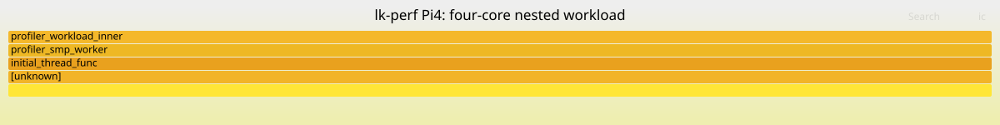

# Real Pi workload: FlameGraph and Perfetto demo

Captured on 2026-10-05 by Codex on the Raspberry Pi 4B (A72, AArch32,
Non-secure SVC), using the existing lk-perf image. This is **real hardware
data**, not the synthetic exporter regression fixture. No target code was
changed or rebuilt for this demo.

Designated workload: `profiler smp 400000000`, four concurrent worker threads,
each doing 400 million iterations of the integer nested-call workload.
Sampling: PMU event **0x11 (CPU cycles)**, counter reload **1000000**, on all
four cores. This is a controlled busy-loop demonstration, not a production
application benchmark or evidence about A55 performance.

## Results

| Measurement | Observed result |
|---|---|
| Retained target samples | 3200; 800 on each of CPU 0, 1, 2, 3; below the 4096/core buffer capacity |
| Accepted export / Perfetto import | 3200 / 3200 |
| Final dump integrity | 0 malformed records, 0 checksum rejections, 0 observed sequence gaps |
| Synthetic threads | Four TIDs, 800 samples each |
| First / last sample | Target time 8.269296 / 9.601825 seconds |
| Sample span | 1.332529 seconds; not an exact workload-duration measurement |
| Leaf hotspot | `profiler_workload_inner`: all 3200 accepted samples |
| Recovered stack | `[unknown] → initial_thread_func → profiler_smp_worker → profiler_workload_inner` |
| Importer | Perfetto Trace Processor v58.2; zero nonzero error stats |
| Scheduling / counters imported | 0 scheduler rows, 0 counter rows |



Open [flamegraph.svg](flamegraph.svg) in a browser for interactive zoom/search.
Its widths count **samples**, not measured wall-time durations. Because all
workers run the same loop, the aggregate graph has a single stack shape.
The whole-width inner function is the expected hotspot. `workload_mid` and
`workload_outer` do not appear because this build tail-call-eliminates their
frames. The unresolved outer frame is retained visibly as `[unknown]`;
it is not proof of a real caller or a complete stack. The three named frames
are useful calling context, while full unwind completeness remains unproven.

The Perfetto results provide a different view: [threads.csv](threads.csv)
separates the four synthetic thread identities, and [time_bins.csv](time_bins.csv)
shows 60 samples per thread in each full 100 ms bin, then 20 each in the final
partial bin. This describes sampled activity over time; it does not establish
scheduling intervals or utilization. This importer has no CPU field in
`cpu_profile_stack_sample`; use the text/metadata for per-core counts.

## Capture on the Pi

Before opening serial, synchronize the shared BOLT handoff and publish a Pi
reservation. Use one serial owner. Recheck the running firmware and baud;
here the previous BOLT shell responded at 3 Mbaud, while the lk-perf payload
uses 6 Mbaud. The loader is still 115200. The first upload used the existing
`reboot_to_chainloader(..., 3000000)` helper before uploading, then switched
to 6000000 after the CRC-verified transfer.

The commands executed after loading the image were:

```text
profiler stop
profiler pmustop
profiler clear
profiler pmustart 0x11 1000000
profiler smp 400000000
profiler pmustop
profiler stop
profiler status
profiler dump
```

For another run when lk-perf is already running at 6 Mbaud, the standard
Windows host runner is:

```powershell
py -3.12 scripts/pi4_run.py build/lk/build-rpi4-test/lk.bin `
  --port COM5 --post-jump-baud 6000000 --reboot --wait 20 --log fresh.log `
  -- "profiler stop" "profiler pmustop" "profiler clear" `
     "profiler pmustart 0x11 1000000" "profiler smp 400000000" `
     "profiler pmustop" "profiler stop" "profiler status" "profiler dump"
```

Use the matching build ELF; Linux/WSL paths must be made available to the
Windows runner, for example through the WSL UNC checkout. Do not assume
`--reboot` with 6 Mbaud will recover a different payload running at 3 Mbaud.
If the loader does not return, a manual power cycle is required.

The initial echo-and-log dump exported only 3195 samples: four malformed
records and five sequence gaps (overlapping measures). Both samplers were
already stopped. A second `profiler dump`, read into a memory buffer without
per-chunk terminal/disk flushes, recovered **all 3200 samples from those same
buffers**. It did not repeat the workload. The archives preserve both the
initial boot/capture session and the successful redump, rather than repairing
damaged records. See [first-dump.metadata.json](first-dump.metadata.json).
This is an observed host/serial-path loss; reducing output work helped this
retry, but does not establish that all serial loss is fixed.

## Export and generate the FlameGraph

From the repository root in WSL/Linux, using uncompressed input files:

```bash
python3 scripts/pi4_perf_export.py capture.log lk.elf \
  --image lk.bin --output demo.perf --mode pmu \
  --event cpu-cycles --period 1000000 --run-id pi4-smp-demo-20261005
```

The exporter writes perf-script text and a metadata sidecar. Convert each
record's leaf-to-root frame list to a root-to-leaf semicolon-separated stack
and count identical stacks (the small [replay.py](replay.py) implements this).
Then run Brendan Gregg's [FlameGraph renderer](https://github.com/brendangregg/FlameGraph):

```bash
perl /path/to/flamegraph.pl --hash --countname samples \
  --title 'lk-perf Pi4: four-core nested workload' demo.folded > flamegraph.svg
```

Each sample contributes one folded count. The fixed PMU period describes
the trigger; it is not an elapsed-time conversion. The renderer is an external
tool, not vendored into this repo. Its source URL and SHA-256 are recorded
in [verification.json](verification.json).

## Analyze in Perfetto

You can also [open the published capture directly in Perfetto](https://ui.perfetto.dev/#!/?url=https://raw.githubusercontent.com/shadowfax80/lk-perf/main/docs/results/lk_perf_demo_20261005/demo.perf),
using its documented [public trace URL mechanism](https://perfetto.dev/docs/visualization/deep-linking-to-perfetto-ui).
Graphical interaction was not automated in this session because no browser
control surface was available; the real CLI import and all saved queries
were verified.

Download [demo.perf](demo.perf), open [Perfetto UI](https://ui.perfetto.dev/),
and use **Open trace file**. Perfetto documents
[perf-script import](https://perfetto.dev/docs/getting-started/other-formats).
Keep [demo.perf.metadata.json](demo.perf.metadata.json) alongside it; the UI
does not consume this sidecar automatically.

Use the Query/SQL interface to run [summary.sql](summary.sql),
[threads.sql](threads.sql), [leaf.sql](leaf.sql), and
[time_bins.sql](time_bins.sql). Their saved CSV files show the actual CLI
results. Sample counts, per-thread counts, min/max timestamps (within 1 ns
of the microsecond inputs), and complete exported stack paths were checked
against the same accepted data used for the FlameGraph.

The equivalent **verified command-line analysis** is:

```bash
python3 /path/to/trace_processor query -f \
  docs/results/lk_perf_demo_20261005/threads.sql \
  docs/results/lk_perf_demo_20261005/demo.perf
```

Choose a time interval by adding `WHERE s.ts BETWEEN <start_ns> AND <end_ns>`
to a sample query. That is how to compare the calling context in different
time windows; the collapsed FlameGraph alone no longer retains timestamps.
The user interface may vary by version; the saved SQL and CLI results are
the reproducible analysis evidence.

## Replay without hardware

`capture.log.gz` is the successful stopped-buffer redump;
`boot-session.log.gz` records upload and actual workload commands, including
the imperfect first dump. `lk.elf.gz` and `lk.bin.gz` preserve the exact
debug ELF and uploaded payload. GNU objcopy of that ELF matched the binary
byte for byte. Export metadata records hashes of the uncompressed artifacts;
`verification.json` records archive/result hashes and the consumer checks.
The target does not supply a build ID, so the transfer log and host identity
checks remain operator evidence, not target-attested identity.

Run from the repository root with the already acquired tools, or supply
paths to the official standalone Trace Processor and FlameGraph renderer:

```bash
python3 docs/results/lk_perf_demo_20261005/replay.py \
  --out build/demo-replay-new \
  --trace-processor build/export-verification/trace_processor \
  --flamegraph build/demo-20261005/flamegraph.pl
```

The output directory must be new. Replay validates decompressed input hashes,
re-exports the raw capture, checks identical perf text/folded stacks, generates
the SVG, and repeats all seven SQL result sets. No serial port is opened.
Different importer versions can change rounding/CSV behavior; this evidence
and exact replay were verified with the version in `verification.json`.

Known limits still apply: missing/unknown frames, invisible IRQ-masked
execution, no scheduling/wakeup/blocking/frequency history, pointer reuse,
and no general target footer/freeze/overwrite guarantee. A complete clean
serial dump does not prove absence of sampling bias or missed PMU overflows.

Handoff: Pi left at the lk-perf shell at **6000000 baud**, both samplers
stopped, 3200 samples retained, COM5 closed. No watchdog command was issued
by lk-perf; software reset replaced the previous BOLT payload. Recheck state
before the next use. No SD-card, backend source, or shared build change.
